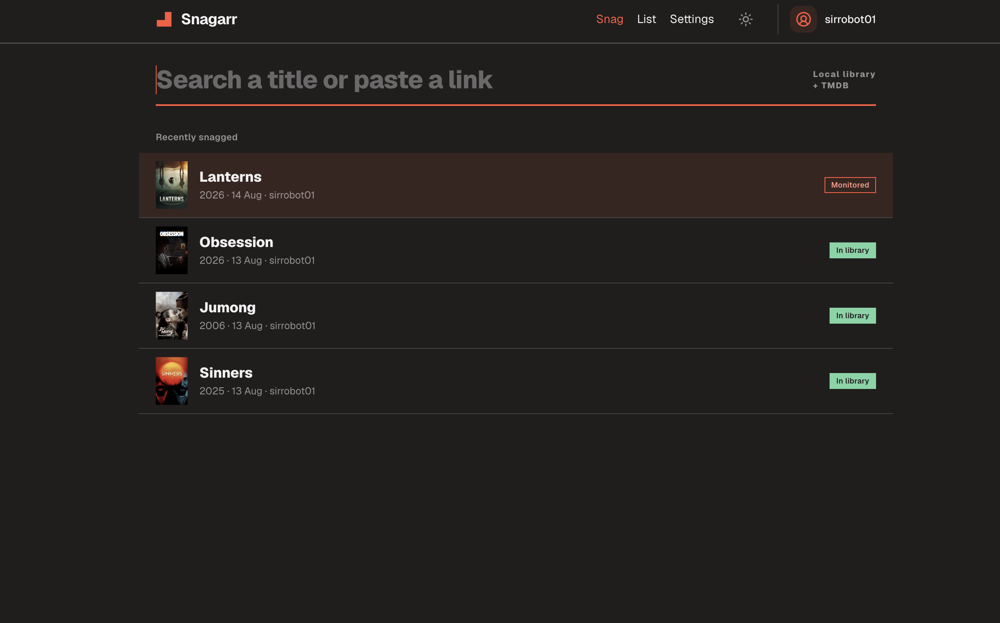
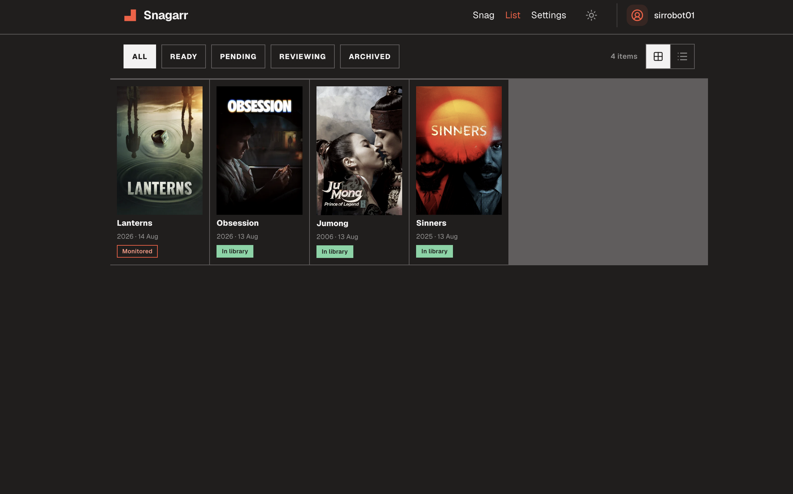
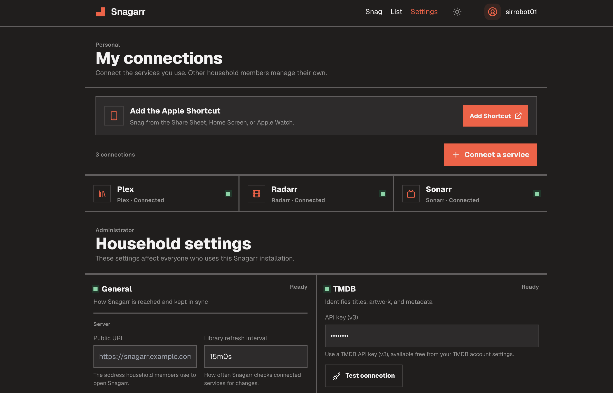
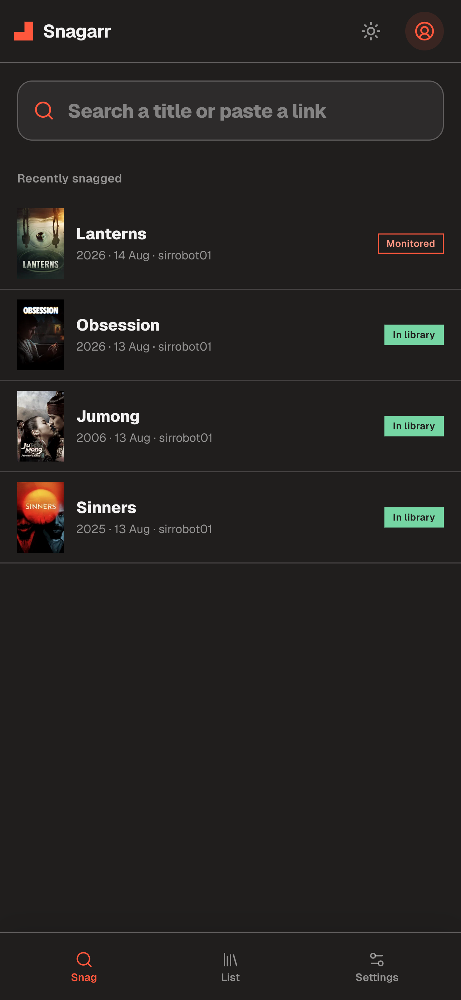
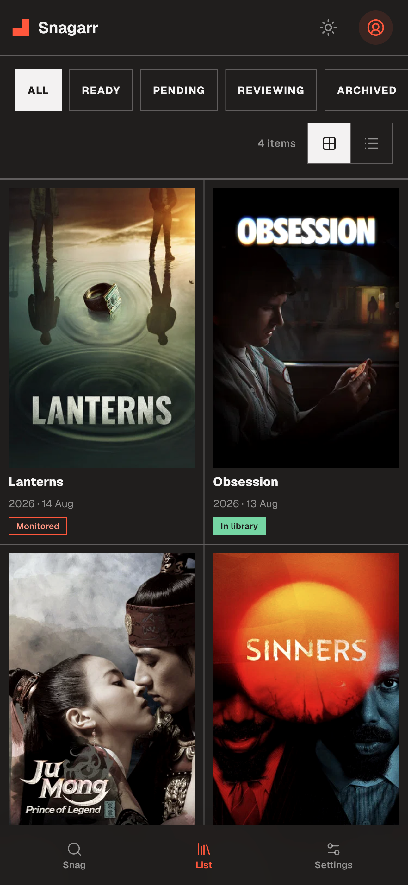
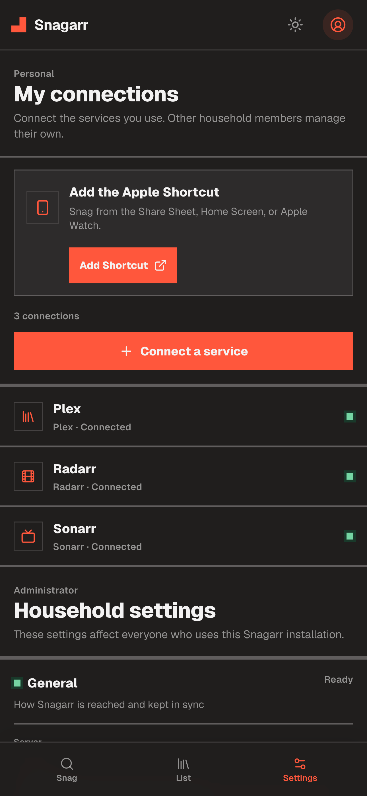

<div align="center">


# Snagarr

**Snag it now, watch it later.**

[](https://github.com/sirrobot01/snagarr/actions/workflows/ci.yml)
[](https://github.com/sirrobot01/snagarr/releases)
[](LICENSE)
[](https://sirrobot01.github.io/snagarr)

</div>

Capture a title in one box. Snagarr resolves it against TMDB, hands it to Radarr
or Sonarr, and puts it in a **Snagged** collection on your media server once the
file lands.

It is the capture and recall layer for an existing \*arr stack. It feeds
Overseerr, Radarr and Sonarr rather than replacing them.



<details>
<summary><strong>More screenshots</strong> — the list, settings, and the mobile layout</summary>
<br>





<p>



</p>

</details>

## Design

| | |
|---|---|
| **One binary** | Go + embedded React UI + SQLite. No database server, no Redis, no reverse proxy required. |
| **Local indexes** | Your library and \*arr lists are mirrored into SQLite. Search and state badges are set arithmetic against local tables — the request path never waits on Plex or Radarr. |
| **Degrades, never breaks** | A stale index keeps serving. TMDB down means search falls back to your library. |
| **API first** | Every client is a thin wrapper over `POST /api/v1/capture`. |
| **Per-user services** | Each household member connects their own Radarr, Sonarr, Overseerr and media server. State is the household union; actions and pushes are personal. |

## Install

```yaml
services:
  snagarr:
    image: ghcr.io/sirrobot01/snagarr:latest
    ports: ["8080:8080"]
    volumes: ["./data:/data"]
    environment:
      PUID: 1000
      PGID: 1000
      TZ: Europe/London
    restart: unless-stopped
```

```bash
docker compose up -d
```

Open `http://localhost:8080` and create the first administrator account.

`PUID` and `PGID` are the user and group the process runs as, the same pair
Radarr and Sonarr take. Set them to your own (`id -u` and `id -g`) and the data
directory ends up owned by you. Both default to `1000`.

Binaries for linux, darwin, windows and freebsd are on the
[releases page](https://github.com/sirrobot01/snagarr/releases). Run
`snagarr serve`; it listens on `:8080` and writes to `./data`.

## Setup

| Service | Needed for |
|---|---|
| TMDB API key | Built in — release builds ship a shared key. Add your own to override. |
| Plex / Emby / Jellyfin | Library badges, Snagged collection. Plex links by sign-in or token. |
| Radarr / Sonarr | One-tap send. |
| Overseerr | Request instead of direct push. |
| ntfy | Availability pushes. |

Every service card has a **Test connection** button.

## Capture clients

| Client | How |
|---|---|
| Web | The add box is the home page. It focuses on desktop load; touch devices open without forcing the keyboard. `/` refocuses it. |
| Apple Shortcut | Import the published one, or build your own and share it as an iCloud link. |
| CLI | `snagarr login https://snagarr.example.com`, then `snagarr snag "Sinners"`. |
| Bookmarklet | Generated in Settings. Sends the current page. |
| Anything | `POST /api/v1/capture` with a bearer token. |

```bash
curl -X POST https://snagarr.example.com/api/v1/capture \
  -H "Authorization: Bearer $SNAGARR_TOKEN" \
  -H "Content-Type: application/json" \
  -d '{"query":"sinners","source":"cli"}'
```

## Household

One shared list with attribution. No passwords — tokens belong to users.

Members capture, browse and resolve. Admins additionally send to \*arr, delete
other people's items, and manage users and settings. Pushes name the capturer:
*"Sinners is ready — snagged by Amina, 12 Jul."*

## Documentation

[sirrobot01.github.io/snagarr](https://sirrobot01.github.io/snagarr) — install,
configuration, environment variables, webhooks, clients, HTTP API.

## Develop

```bash
task install   # Go tools, web dependencies
task dev       # API with live reload + Vite dev server
task test      # Go and web tests
task build     # one binary with the UI inside, into bin/
```

## Credits

This product uses the TMDB API but is not endorsed or certified by TMDB.

[MIT](LICENSE).
